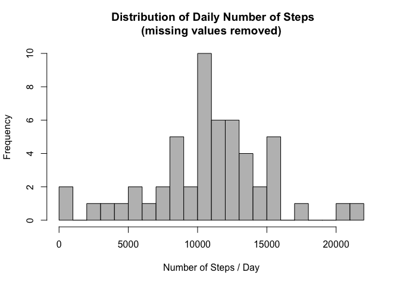
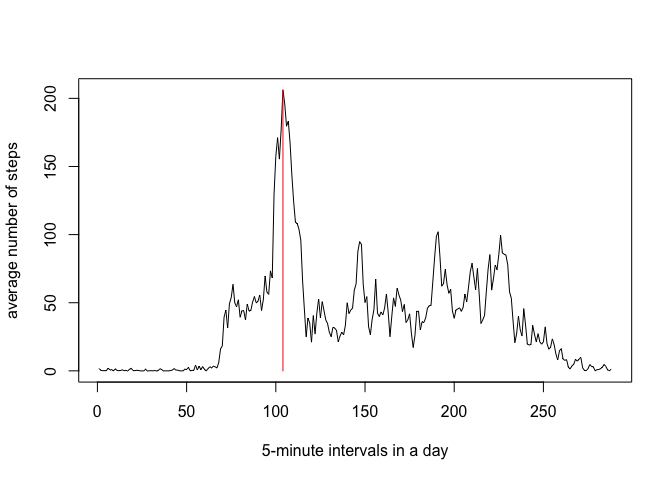
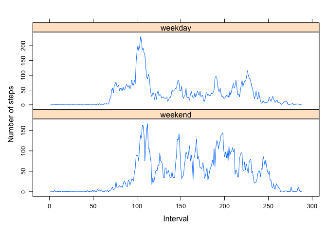

The data for this assignment can be downloaded from the course web site:
Dataset: [Activity monitoring data](https://d396qusza40orc.cloudfront.net/repdata%2Fdata%2Factivity.zip) [52K]

The variables included in this dataset are:

+ steps: Number of steps taking in a 5-minute interval (missing values are coded as \color{red}{\verb|NA|}NA)

+ date: The date on which the measurement was taken in YYYY-MM-DD format

+ interval: Identifier for the 5-minute interval in which measurement was taken

# Loading and preprocessing the data

#### 1. Load the data:

```r
activity <- read.csv("activity.csv")
```

#### 2. Process the data, i.e. first remove missing values and format the date:

```r
activity$date = as.Date(activity$date)
activityNoNA <- activity[ !is.na(activity$steps), ]
```

# What is mean total number of steps taken per day?

#### 1. Total number of steps taken per day (ignoring missing values for now):

```r
datesSum <- with( activityNoNA, aggregate(steps, list(date), sum ) ) 
colnames(datesSum) <- c("date","sum")
sum(datesSum$sum )
```

```
## [1] 570608
```

#### 2. Histogram of the total number of steps taken each day:

```r
hist(datesSum$sum, main = " Distribution of Daily Number of Steps\n(missing values removed)", col="gray", xlab="Number of Steps / Day", breaks = 20)
```

<!-- -->

#### 3. Mean and median:
Mean of the total number of steps taken per day:

```r
mean( datesSum$sum )
```

```
## [1] 10766.19
```

Median of the total number of steps taken per day:

```r
median( datesSum$sum )
```

```
## [1] 10765
```

# What is the average daily activity pattern?


```r
ramp1to288 <- 1:288
oneDayIntervals <- activity$interval[ ramp1to288 ]
avgNumSteps <- ramp1to288
maxNumSteps <- 0
for ( i in ramp1to288 ) { 
    avgNumSteps[i] <- mean( activityNoNA[ 
        activityNoNA$interval == oneDayIntervals[i], ]$steps );
    if( avgNumSteps[i] > maxNumSteps )
    {
        maxNumSteps <- avgNumSteps[i]
        iWithMaxSteps <- i        
    }
}

plot(avgNumSteps, type="l", xlab="5-minute intervals in a day", ylab="average number of steps")
segments( iWithMaxSteps,0, iWithMaxSteps, maxNumSteps, col = "red")
```

<!-- -->

The 5-minute interval which, on average across all the days in the dataset, contains the maximum number of steps is the 
104
th, that's:

```r
cat( "interval number ",activityNoNA[ iWithMaxSteps,]$interval, "." )
```

interval number  835 .

# Imputing missing values

#### 1. Total number of missing values (i.e. number of rows with \color{red}{\verb|NA|}NAs) in the dataset:

```r
sum(is.na( activity$steps ))
```

[1] 2304

#### 2. Strategy for filling in all of the missing values in the dataset: 
If a value is NA we replace it by the mean for that 5-minute interval accross all days.

#### 3. Creating a new dataset that is equal to the original dataset but with the missing data filled in:

```r
activityNAimputed <- activity

for ( i in 1:dim(activity)[1] ) {
    if(is.na(activity$steps[i])){
        activityNAimputed$steps[i] = avgNumSteps[ ((i-1)%%288)+1 ];
    }
}
```

Calculating new Results, with NAs filled with imputed data:

```r
datesSumImputed <- with( activityNAimputed, aggregate(steps, list(date), sum ) )
colnames(datesSumImputed) <- c("date","sum")
```

Total number of steps taken per day:

```r
sum(datesSumImputed$sum)
```

```
## [1] 656737.5
```

#### 4. Histogram of the total number of steps taken each day:

```r
hist(datesSumImputed$sum, main = "Frequency Distribution of Daily Number of Steps\n(imputed missing values)", col="gray", xlab="Number of Steps / Day", breaks = 20)
```

<!-- -->

Mean of the total number of steps taken per day:

```r
mean(datesSumImputed$sum )
```

```
## [1] 10766.19
```

Median of the total number of steps taken per day = 

```r
median(datesSumImputed$sum )
```

```
## [1] 10766.19
```

These means don't differ from the first part of the assignment, because we're imputing NAs using the mean for each interval (adding an item to a serie with the value of the mean won't change the mean). The new median is almost the same as the previous one, because the original mean was equal the median.

So in this case the impact of imputing missing data on the estimates of the total daily number of steps is negligible.


# Are there differences in activity patterns between weekdays and weekends?
#### 1. Creating a new factor variable "dayType" in the dataset with two levels – “weekday” and “weekend” indicating whether a given date is a weekday or weekend day:

```r
dayType <- function(x){
    day <- weekdays ( x )
    if ( day == "Saturday" || day == "Sunday" ){
        return("weekend") 
    } else {
        return("weekday")
    }
}
activityNAimputed$dayType <- sapply( activityNAimputed$date, dayType )
```

#### 2. Panel plot containing a time series plot of the 5-minute interval (x-axis) and the average number of steps taken, averaged across all weekday days or weekend days (y-axis): 

```r
ramp1to288 <- 1:288
oneDayIntervals <- activity$interval[ ramp1to288 ]
avgNumStepsNAimputed <- ramp1to288
days <- ramp1to288
avgNumSteps_WE <- ramp1to288
avgNumSteps_WD <- ramp1to288
for ( i in ramp1to288 ) {
    currInterval <- activityNAimputed[ activityNAimputed$interval == oneDayIntervals[i], ]
    currDay <- weekdays( currInterval$date )
    avgNumSteps_WE[i] <- mean( currInterval[ currInterval$dayType == "weekend", ]$steps )
    avgNumSteps_WD[i] <- mean( currInterval[ currInterval$dayType == "weekday", ]$steps )
}

WD_WE <- ts( cbind(wd = avgNumSteps_WD, we= avgNumSteps_WE) )

library(lattice)
xyplot(WD_WE, screens = list(wd="weekday", we="weekend"),
           xlab = "Interval",
           ylab = "Number of steps")
```

<!-- -->

On weekdays there are more steps earlier in the day and a morning peak, probably as the person wakes up early and walks to work. The steps then come down until a second peak in the late afternoon, possibly as the person makes her way home from her worplace. On weekends the steps begin later in the morninga and stay high with multiple peaks during the day, as the person is lilely sitting less at her desk.  We observe more steps later in the evenings on weekends, although it may be more intersting to compare Friday & Saturday evenings vs the other evenings, because the weekend pattern may typically start Friday after work and stop Sunday evening at people prepare for the workweek.   
